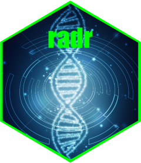

# radr <a href="https://thierrygosselin.github.io/radr/"></a>

```{r setup, include=FALSE}
description <- read.dcf("DESCRIPTION")
version <- unname(description[1, "Version"])
knitr::opts_chunk$set(collapse = TRUE, comment = "#>", fig.path = "README-")
```

<!-- badges: start -->
[](http://www.repostatus.org/#active)
[](commits/main)
[)`-brightgreen.svg)](/commits/main)
<!-- badges: end -->

## Origin of the name

RADseq remains widely used, while whole-genome sequencing and its many variants
increasingly need to be on researchers' **radar**. My hope is that **radr** will
help researchers make that transition.

[`genometranslator`](https://thierrygosselin.github.io/genometranslator/) and
[`radr`](https://thierrygosselin.github.io/radr/) are descendants of
**radiator**. Their emergence is best viewed as a small software **adaptive
radiation**: functions inherited from **radiator** were partitioned and
developed into two packages occupying distinct computational niches.

* [`genometranslator`](https://thierrygosselin.github.io/genometranslator/) reads, standardizes, and writes genomic formats;
* [`radr`](https://thierrygosselin.github.io/radr/) explores, diagnoses, visualizes, and filters individual genomic data created by
[`genometranslator`](https://thierrygosselin.github.io/genometranslator/).

## Installation

Starting from a basic R installation, install the CRAN installer and required
Bioconductor foundation first:

```{r installation, eval=FALSE}
install.packages(c("BiocManager", "remotes"))

BiocManager::install(c(
  "gdsfmt",
  "Rsamtools",
  "SeqArray"
))

remotes::install_github("thierrygosselin/tgbase")
remotes::install_github("thierrygosselin/genometranslator")
remotes::install_github("thierrygosselin/radr")
```

The `Remotes` field in radr's `DESCRIPTION` records its GitHub dependencies,
but the explicit sequence above makes a clean installation easier to diagnose.

Check the installation without changing it:

```{r dependency-check, eval=FALSE}
radr::radr_dependencies()
```

The returned table distinguishes required components from optional components
and states which workflow uses each optional dependency.


There is no plan to submit the package to CRAN or Bioconductor. A GitHub-based
development environment suits me well.

### Optional command-line tools with Conda

Some VCF-level filters use `bcftools`, while `run_bayescan()` uses the BayeScan
executable. These are programs, not R packages. A shared Conda environment can
provide both:

```bash
conda create --name genomics --channel conda-forge --channel bioconda bcftools bayescan=2.1
conda activate genomics
bcftools --version
bayescan --help
```

For an existing environment:

```bash
conda activate genomics
conda install --channel conda-forge --channel bioconda bcftools bayescan=2.1
```

Start R or RStudio from the activated environment, then verify visibility:

```{r executable-check, eval=FALSE}
Sys.which(c("bcftools", "bayescan"))
radr::radr_dependencies()
radr::check_bayescan()
```

## A minimal workflow

Import and standardize a genomic file with `genometranslator`, then diagnose
and filter the resulting GDS with radr:

```{r workflow, eval=FALSE}
genome <- genometranslator::read_genome(
  data = "individuals.vcf.gz",
  strata = "strata.tsv"
)

# Preserve the original sample and marker order for the first missingness view
ibm <- radr::detect_ibm(
  data = genome,
  filename = "initial_missingness.png"
)

# Guided exploration for a new dataset
screened <- radr::explore_genomes(data = genome)

# Dataset-tailored workflow with functions chained directly with the native R pipe:
genome.filtered <- genome |>
  radr::filter_genotyping() |>
  radr::filter_ma() |>
  radr::filter_snp_number() |>
  radr::filter_ld() |>
  radr::filter_coverage() |>
  radr::filter_individuals() |>
  radr::detect_mixed_genomes() |>
  radr::detect_duplicate_genomes()
```

`explore_genomes()` offers a guided first exploration. It is not a universal
filtering recipe: established analyses should use selected `detect_*()` and
`filter_*()` functions in an order justified for the dataset.
Filtering individuals first changes marker statistics, while
filtering markers first changes individual statistics.

The
[getting-started vignette](https://thierrygosselin.github.io/radr/articles/using_radr.html#build-a-tailored-workflow)
develops two contrasting examples: a marker-first workflow for a noisy callset
and a sample-first workflow for known sequencing failures. It also explains how
to return to guided exploration after correcting a known problem and how to
compare alternative filtering orders reproducibly.

## Citation

```{r citation, eval=FALSE}
citation("radr")
packageVersion("radr")
```

Until a dedicated publication or DOI is available, cite the version and, for a
development build, record the Git commit and access date:

> Gosselin, T. (`r format(Sys.Date(), "%Y")`). *radr: Explore, diagnose and
> filter genomic data*. R package version `r version`.
> <https://github.com/thierrygosselin/radr>. Accessed
> `r format(Sys.Date(), "%Y-%m-%d")`.

## Website and support

Documentation and articles are available at
<https://thierrygosselin.github.io/radr/>. Report problems or request features
through the [GitHub issue tracker](https://github.com/thierrygosselin/radr/issues).
